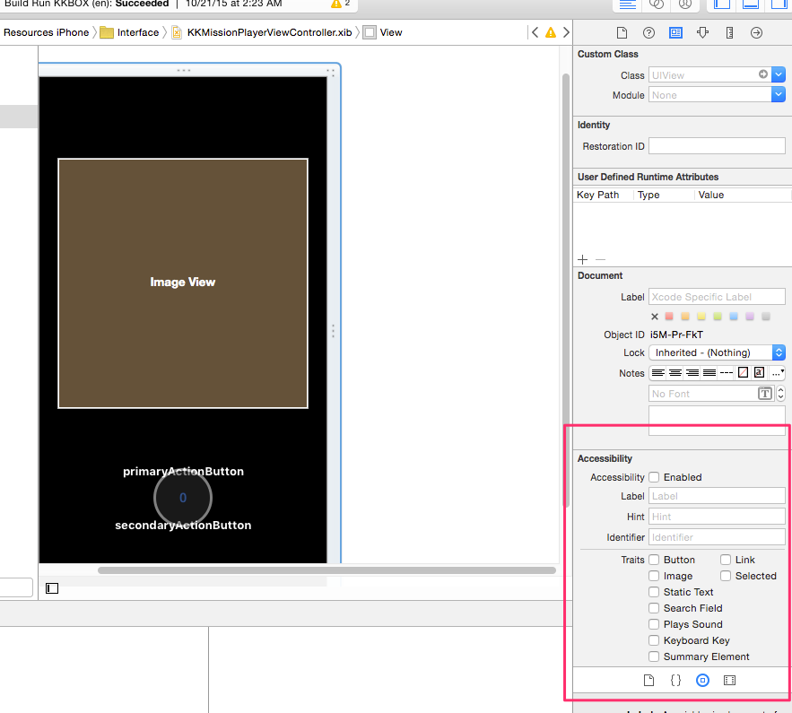
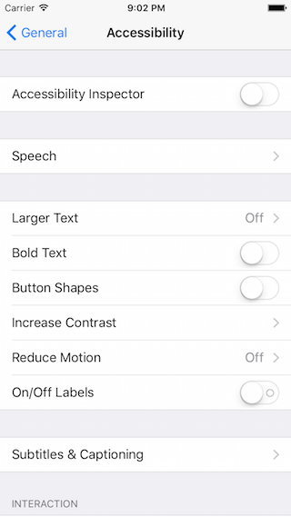
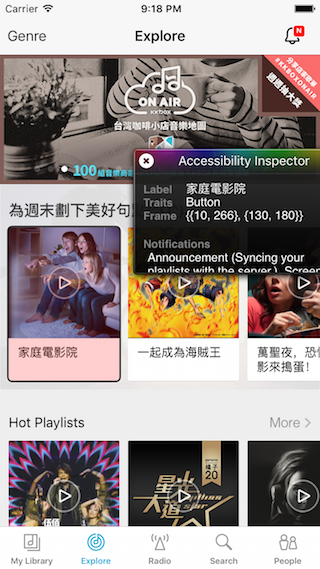

基本支援
--------

在絕大多數狀況下，Accesibility 資訊是加在 UIView 物件上的。所以，如果
你只有用到 UIView 物件設計 UI，就可以選擇在 Interface Builder 裡頭，或
是使用程式碼加入 accessibility 資訊。

在 Interface Builder 的 Identity Inspector 分頁中，就可以設定這個 UI
元件的相關資訊。



也可以透過程式碼設定，iOS SDK 定義了 UIAccessibility 這個 informal
protocol（也就是 NSObject 的 category），所有繼承自 NSObject 的物件都
具備此一 interface，你可以透過 accessibilityLabel、accessibilityHint
等屬性，標記 UI 元件的標題與詳細說明。像是，我們建立了一個叫做
closeButton 的按鈕時，就可以這樣寫：

``` objc
[closeButton setAccessibilityLabel:NSLocalizedString(@"Close", @"")];
[closeButton setAccessibilityIdentifier:@"Close"];
[closeButton setAccessibilityTraits:UIAccessibilityTraitButton];
```

說一下 accessibility identifier 與 accesibility label 的差別：
VoiceOver 基本上只會念出 accesibility label，而不會念出 accesibility
identifier，但我們往往也會額外設計 accesibility identifier，原因是，
accessibility 資訊除了用在 VoiceOver 上，也會用在自動化 UI 測試上，當
我們在寫 UI 自動化測試時，就會比較想使用 accessibility identifier 而不
是 accessibility label 尋找特定元件，理由是 accessibility identifier不
會因為切換多國語系而影響，但是在不同語系下，accessibility label 會改變。

在設置 UISegmentedControl 的 accessibility 資訊的時候，要特別注意圖片
型態的 segment。每個 segment 當中可以是文字或是圖片，我們可以用
`-setTitle:forSegmentAtIndex:` 或是 `-setImage:forSegmentAtIndex:` 設
置 segment 中的內容，如果是文字的話，我們所傳遞進去的 title 自然會變成
accessibility label，但，如果是圖片呢？我們無法直接設置某個 segment 的
accessibility 資訊，所以遇到圖片，我們會直接對 UIImage 物件設置
accessibility 資訊—畢竟 UIImage 也是繼承自 NSObject 的物件，而
UIAccessibility 根本就是 NSObject 的 category。

所以遇到 UIImage 也可以這樣寫：

``` objc
[closeImage setAccessibilityLabel:NSLocalizedString(@"Close", @"")];
[closeImage setAccessibilityIdentifier:@"Close"];
```

開發過程中，除了實機測試之外，也可以使用 iOS Simulator 檢驗目前程式對
VoiceOver 的支援狀態，方法是在模擬器中的偏好設定中，把 Accessibility
Inspector 打開，模擬器畫面中就會出現一個小畫面，在選取畫面中某個 UI 元
件時，Accessibility Inspector 就會列出各種相關資訊。

Accessibility Inspector 在設定中的位置：



開啟之後的效果：


