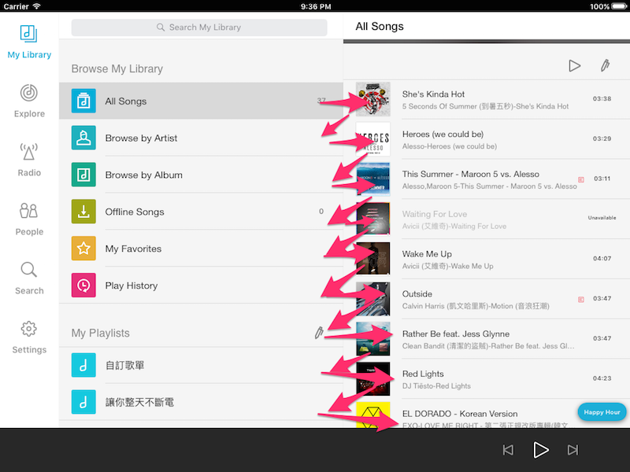
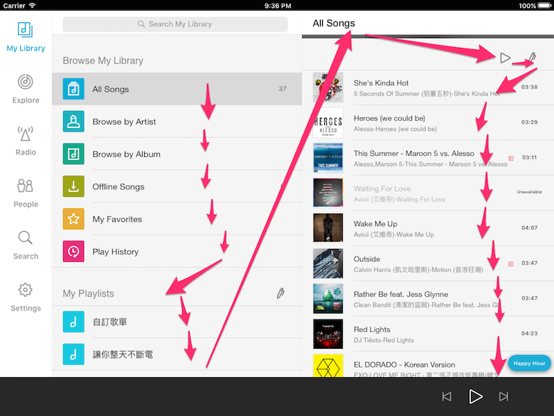

VoiceOver 的方向
----------------

VoiceOver 在朗讀螢幕上有哪些 UI 元件的時候，基本上按照由右至左，由上而
下的方向，會先把橫排的資訊念完，然後繼續往下念。在有些時候這種順序會造
成使用上的困擾，以 KKBOX 的 iPad 版本來說，我們有好幾個並排的
UITableViewController，如果是由右至左再由上而下，就會變成會交錯朗讀不
同的 UITableViewController 裡頭的 cell。如下圖：



但我們期待的是，先把第一個 table 念完，再去念另外一個 table。



要修正這個問題，我們要做的事情其實很簡單：我們要去告訴某個 view，應該
要把它的所有 subviews 都變成是一個群組，VoiceOver 要先念完這個群組裡頭
所有的東西，再去移動到其他的 UI 元件上。只要寫這樣的程式碼：

``` objc
[self.view setShouldGroupAccessibilityChildren:YES];
```

就可以讓 view 裡頭變成群組了。


