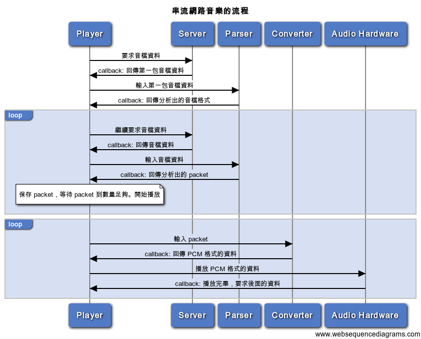

基礎知識
--------

在進入 Core Audio API 之前，先講一些跟 Audio 相關的基礎知識。這些資料
在 wikipedia 上都可以查到，我們盡可能簡短說明。

### 聲音與數位音訊

聲音是空氣或是在水中的震動，是一種能夠被人耳所感知的類比訊號，單位是分
貝（dB），人耳可以忍受的聲音介於 0 到 100 分貝之間。震動幅度的強弱決定
了是大聲或是小聲，震動頻率的密集程度決定了是高音或是低音。

所謂的數位音訊或數位音樂，就是將聲波這種連續的訊號，轉換成一連串的數字，
用零與一的二進位數字盡可能地重現在大自然中發生的事物；用一個數字，標示
在某個時間單位時訊號的強弱程度。

之所以說「盡可能」，是因為類比轉換成數位的過程中一定會有所捨棄。我們捨
棄了超過 100 分貝的部份，在大自然中存在超過 100 分貝的聲音，但是超過了
人耳可以忍受的範圍；而在大自然中，時間可以不斷無限切分到人類感官無法感
知的單位，但我們要將訊號記錄下來，還是必須要定義一個單位。這種將一個一
個時間單位的訊號強弱程度記錄下來的過程，叫做採樣（sampling），每一個時
間單位上的樣本，叫做 sample，或是一個 frame，一秒鐘內有多少 sample，叫
做採樣比（sample rate）。

現在定義的 CD 音質是 44100 Hz，也就是一秒鐘內有 44100 個 sample，這個
規格的原因是人耳可以聽到的頻率介於 20 到 20000 Hz 之間，根據
Nyquist–Shannon 的採樣定律，只要採樣比超過 20000 Hz 的兩倍，人耳就根本
聽不出差別。被錄製下來的聲音可以會用非帶號的整數或浮點數儲存，整數的話，
每個 sample 會介於 0 到整數最大值之間，浮點數則會介於 0.0 到 1.0 之間。

這種完全還沒有壓縮過的資料，就叫做 PCM 格式，我們常用的 WAV、AIFF、CAF
檔案，都是這種格式，而 Audio 硬體最後要播放的，也是這種資料。所以，CD
其實就是一秒鐘有 44100 個 16 位元整數，而從 CD 開始，其實我們就已經進
入了數位音樂時代。

沒有壓縮過的音訊檔案以現在的眼光看都還是很大。比方說，我們用 16 位元非
帶號整數（兩個 byte）儲存，加上左右聲道，一首歌曲就要 30 mb（44100 *
2 * 2 * 60 * 3 / 1024 / 1024），雖然可以存放在 CD 這種介質上，但並不適
合網路傳輸。到了 90 年代，MP3 等壓縮格式開始流行，音樂變得可以在網路上
傳輸、交換，從此也大幅改變了音樂產業，人們從購買 CD 變成透過網路取得音
樂，也讓現在可以有 KKBOX 這樣的網路串流音樂服務。

### 壓縮音檔

壓縮過的音訊檔案尺寸大大降低，但像 MP3 等格式是破壞性的壓縮，在壓縮過
程中，也會造成音質的降低與失真，所以壓縮的比例同時影響壓縮後的大小與聆
聽時感受到的品質。

音檔壓縮的比例我們使用 bitrate 描述，bitrate 就是這個音檔用多少的資料
（注意，單位是 bit，不是 byte）表示一秒鐘的聲音，KKBOX 目前提供 128kb、
192kb、320kb 三種不同品質的音檔，單位都是 bitrate。kb 是使用十進位，所
以我們可以推算出一首三分鐘的 320kb 的音檔，大約 6.8 MB（320 / 8 *
1000 * 60 * 3 / 1024 / 1024）。

當我們將原始音檔壓縮成 MP3 格式的時候，並不是把整個檔案都壓縮起來，而
是先將連續的原始音檔切成一個一個的小塊，然後一次只壓縮一個小塊，這樣的
小塊叫做 packet，MP3 格式的每個 packet 為 1152 個 frame，用來將每個小
塊做壓縮與解壓縮的程式就是 codec。

之後，我們會在每個 packet 的前方都加上一個簡短的檔頭，標示在這之後是一
個 packet，以及 packet 的長度，一個 MP3 檔案，就是連續的檔頭與 packet
的集合，我們要播放 MP3 檔案，首先就是要透過 parser，找出每個 packet 所
在的位置。AAC ADTS 格式也是使用這種方式包裝資料。

至於 MP4 檔案則是用另外一種方式包裝資料。不同於 MP3 是連續的檔頭與
packet，MP4 格式則是一種巢狀結構：在一個 MP4 檔案中，會有許多叫做 atom
的容器，一個 atom 裡頭可能還會有其他的 atom。其中最主要的兩個 atom 分
別是 moov 與 mdat，mdat 裡頭是連續的 packet 資料，但是這一段資料中並不
會特別著名哪一個 packet 從哪裡開始到結束，而 moov 這邊有所有的 packet
的 offset 位置，也就是，mdat 裡頭有哪些 packet，要拿 moov 這段資料當做
索引。

moov 與 mdat 不一定要哪個在前哪個在後，但如果你要使用 Core Audio API
播放 MP4 檔案，moov 一定要放在 mdat 前方，不然 Core Audio API 會告訴你
它不支援沒有 optimized 過的 MP4 檔案。

但很奇妙，如果你把這個檔案拿去 iTunes 或 QuickTime 裡頭，卻可以正常播
放；所以呢，其實蘋果自己的播放軟體裡頭用的底層，與 Core Audio 並不是相
同的東西，我們也不能期待用蘋果的播放軟體能夠播的檔案，我們就能夠播出來。
如果想要知道某個檔案能不能用 Core Audio 播放，可以使用 command line 底
下的 afinfo 與 afplay 指令檢查。

### 播放網路串流的流程

所以，如果現在我們想要播放位在 server 上的某個 MP3 或 AAC 音檔，流程大
概就是：

1. 發送網路連線，跟 server 要求讀取這個檔案，並且等候連線的 callback
2. 在連線的 callback 中儲存資料，如果這個檔案經過 DRM 保護的話，也要在
   這時候做加解密
3. 把收到的資料送到 parser 中，parse 出檔案格式與 packet 的位置
4. 保存這些 packet
5. 按照播放硬體的播放進度，定時把這些 packet 交給 converter，讓
   converter 呼叫 codec，將我們的 packet 轉換成 PCM 格式
6. 讓 Audio 硬體播放 PCM 格式的資料

