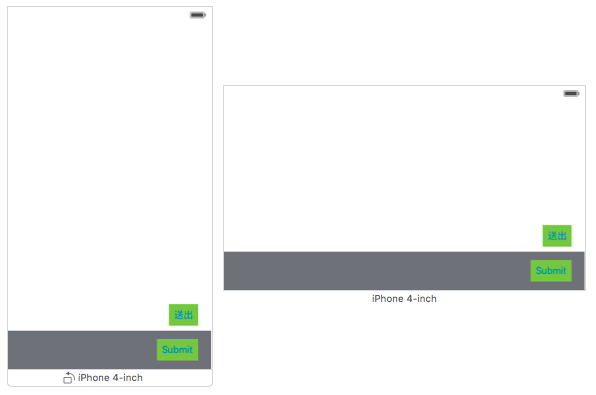
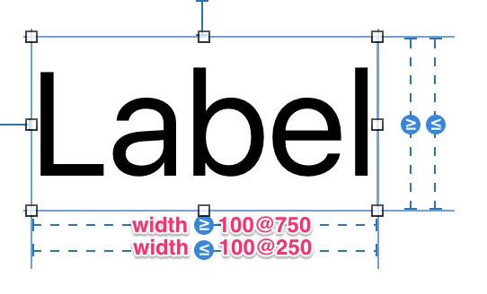
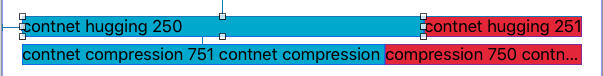

Intrinsic Content Size
---------------------------
> 依照內容尺寸去自動調整元件 Layout 的原則
> view 依照內容尺寸壓縮/撐開 super view 的原則

當我們希望元件的 Layout 去自動適應內容的尺寸，尤其是面對 Localization 不同語言有著不同的文字尺寸的時候。

例如說一個 `送出(submit)`的按鈕使用不同語言時，它要根據文字的寬度去調整 Button 的 Layout，在此情境下給一個固定寬度的 Constraint 不能滿足我們的需求。


```  objc
|----------|      |-------|
|  submit  |      |  送出  |
|----------|      |-------|
```




Auto Layout 將`適應內容`拆解成兩個概念，分別是`內容吸附 (Content Hugging)`和`內容壓縮阻力 (Content Compression Resistance)` 。

- 內容吸附 - 當元件被拉伸時(內容尺寸比 super view 小的時候)，向內拉動的力量
- 內容壓縮阻力 - 當元件被擠壓時(內容尺寸比 super view 大的時候)，向外推擠的力量

**原理**
Auto Layout Engine 會將固有內容尺寸和這些優先權被轉換為 Constraints。一個內容尺寸為 {100，30} 的 label，預設水平/垂直壓縮阻力優先值為 750，水平/垂直的內容吸附性優先值為 250，這四個約束條件將會生成。
```  objc
H:[label(>=100@750)] (content compressing : width >=100@750)
H:[label(<=100@250)] (content hugging : width <= 100@250)
V:[label(<=30@250)] (content hugging : height <= 30@250)
V:[label(>=30@750)] (content compressing : height >=30@750)
```





如上圖所示，第一組 Labels 都是空間大於內容尺寸，此時會比較哪一個 Label 的 content hugging priority 比較高，該 Label 的 Layout 就會優先包覆其 Label。

而第二組則是兩個 Label 都是內容大於所擁有的空間，所以比較誰的 conetne compression resistance priority 比較高，該 Label 就可以優先取用所需的 UI 空間。