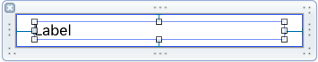
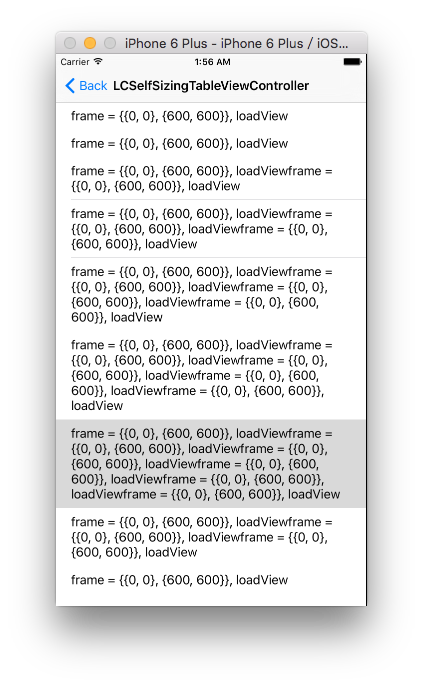
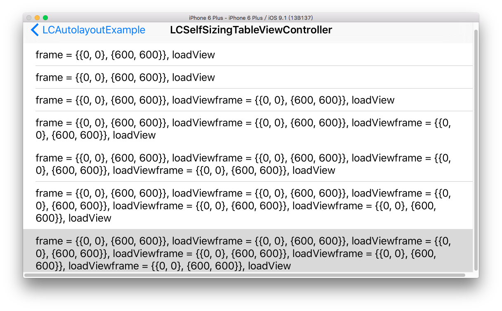

## Self-sizing UITableViewCell height (iOS 8 latter)
http://www.appcoda.com/self-sizing-cells/

首先在客製化的 UITableViewCell 設定好 Auto Layout ，切記上下左右都要設定，要讓內容可以去撐開 superView




在 viewController 之中加入 `tableView.estimatedRowHeight` 與 `tableView.rowHeight = UITableViewAutomaticDimension`
``` objc
tableView.estimatedRowHeight = 44.0;
tableView.rowHeight = UITableViewAutomaticDimension;
```

最後再 `viewDidAppear:`中加入 `tableView.reloadData()`
``` objc
override func viewDidAppear(animated: Bool) {
	tableView.reloadData()
}
```




