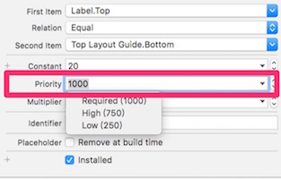

什麼是約束 Constaint?
---------------------------

Constaint：**描述 views 之間相對關係**


如上圖所示，所有藍色的線條皆為 Constraint ，用來描述 view 之間的關係。


### NSLayoutConstraint
```  objc
@interface NSLayoutConstraint : NSObject
@property UILayoutPriority priority; // 1~1000
@property CGFloat constant;
@end
```

```  objc
typedef float UILayoutPriority;
static const UILayoutPriority UILayoutPriorityRequired NS_AVAILABLE_IOS(6_0) = 1000;
static const UILayoutPriority UILayoutPriorityDefaultHigh NS_AVAILABLE_IOS(6_0) = 750;
static const UILayoutPriority UILayoutPriorityDefaultLow NS_AVAILABLE_IOS(6_0) = 250;
static const UILayoutPriority UILayoutPriorityFittingSizeLevel NS_AVAILABLE_IOS(6_0) = 50;
```

在 Interface builder 之中 priority 可以設定 1~1000，但如果要在程式碼中設定，最高只能設定到 **999**。



若想要在 Runtime 時動態改變 Layout ，可以透過變更 Constaint 數值(priority or contant) 或是新增/移除 Constaints 觸發 Auto Layout Engine 重算 Layout 。

```  objc
- (IBAction)makeLabelSamllerAction:(id)sender
{
	self.userNameLabelWidth.constant = 20; // from 100 to 20	
}
```