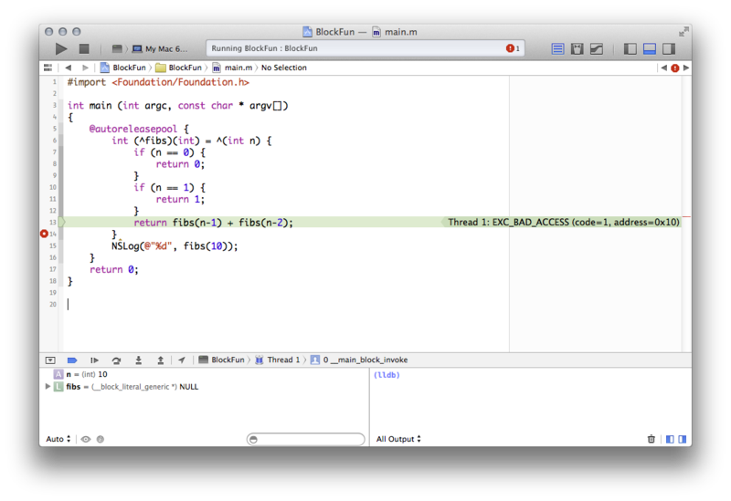
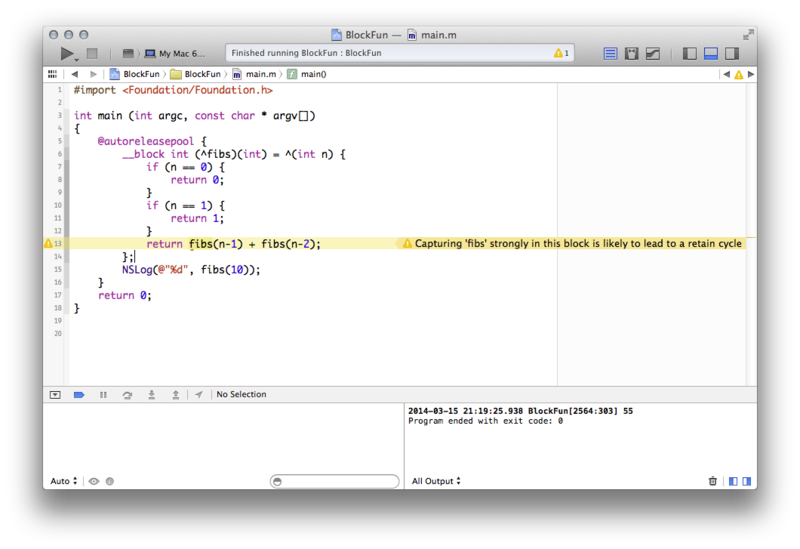
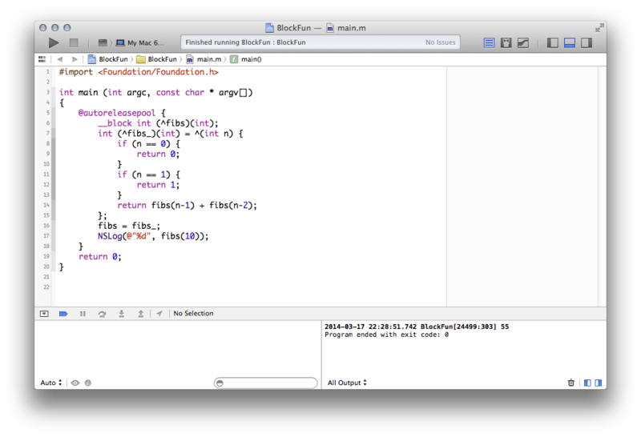

Blocks
======

蘋果在 Mac OS X 10.6 與 iOS 4 之後導入 Block 語法，之後就大幅改變了撰
寫 Objectice-C 語言的方式。

Block 是 Cocoa/Cocoa Touch Framework 中的匿名函式（Anonymous Functions）
的實作。所謂的匿名函式，就是一段 **具有物件性質的程式碼**，這一段程式
碼可以當做函式執行，另一方面，又可以當做物件傳遞；因為可以當做物件傳遞，
所以可以讓某段程式碼變成是某個物件的某個 property，或是當做 method 或
是 function 的參數傳遞，就是因為這種特性，造成最常使用 block 的時機，
就是拿 block 實作 callback。

在有 block 之前，在 Cocoa/Cocoa Touch Framework 上要處理 callback，最
常見的就是使用 delegate（此外也可以使用比較具有 C 語言風格的方式，傳遞
callback function 的 pointer，或是使用 target/action pattern）。在 iOS
4 有了 block 之後，可以看到蘋果自己便大幅改寫了 UIKit 等 Framework 的
API，把原本使用 delegate 處理 callback 的地方，都大幅換成了 block。

Block 的語法
------------

一直以來還是有不少人不滿 block 語法，甚至有人成立了一個叫做
[fuckingblocksyntax.com](http://fuckingblocksyntax.com) 的網站。這個網
站的網域名稱不怎麼優雅，不過裡頭倒是清楚整理了我們應該如何宣告 block。

將 block 宣告成變數（local variable）的語法是：

``` objc
returnType (^blockName)(parameterTypes) = ^returnType(parameters) {...};
```

宣告成 Objective-C property 的語法是：

``` objc
@property (nonatomic, copy) returnType (^blockName)(parameterTypes);
```

宣告成 method 的參數（method parameter）的語法是：

``` objc
- (void)someMethodThatTakesABlock:(returnType (^)(parameterTypes))blockName;
```

在執行某個需要傳入 block 當做參數的 method 的時候，則是用這以下方式呼
叫。這也是絕大多數用 block 當做 callback 的處理方式：

``` objc
[someObject someMethodThatTakesABlock:^returnType (parameters) {...}];
```

把一種 block 宣告成 typedef：

``` objc
typedef returnType (^TypeName)(parameterTypes);
TypeName blockName = ^returnType(parameters) {...};
```

Block 也可以當成 C function 的參數或是回傳結果的型別，但是，在這種狀況
下，我們不能夠直接使用 returnType (^)(parameterTypes) 這種語法，必須要
先宣告成 typedef 才行。也就是說，這樣會被當成不合法：

``` objc
(void (^)(void)) test((void (^)(void)) block) {
	return block;
}
```

但可以寫成這樣：

``` objc
typedef void (^TestBlock)(void);
TestBlock test(TestBlock block) {
	return block;
}
```

雖然 C function 的參數不能夠使用 returnType (^)(parameterTypes) 語法，
但是一個 block 倒是可以使用這種語法撰寫輸入與回傳值的型別，但其實在這
種狀況下，還是比較建議使用 typedef 宣告。比方說，我們現在要宣告一個
block，這個 block 會回傳另外一個型別為 int(^)(void) 的 block，就會寫
成這樣：

``` objc
int (^(^counter_maker)(void))(void) = ^ {
	__block int x = 0;
	return ^ {
		return ++x;
	};
};
```

可讀性實在非常差。不如寫成這樣：

``` objc
typedef int (^CounterMakerBlock)(void);
CounterMakerBlock (^counter_maker)(void) = ^ {
	__block int x = 0;
	return ^ {
		return ++x;
	};
};
```

Block 如何代替了 Delegate
-------------------------

要了解在哪些場合使用 block，我們不妨先看一下蘋果自己如何使用 block。

首先是 UIView 動畫。當我們在某個 view 上面改變了某些 subview 的位置與
大小，或是改變了這個 view 的一些屬性，像是背景顏色等，一般來說不會產生
動畫效果，我們的改動會直接生效，但是我們也可以產生一段動畫效果，這種動
畫我們稱為 UIView Animation。（UIView Animation 其實底層是透過 Core
Animation 完成的，但我們稍晚才會討論 Core Animation。）

像是，我們想要改動某個 subview 的 frame：

``` objc
self.subview.frame = CGRectMake(10, 10, 100, 100);
```

在 iOS 4 之前，我們會使用 UIView 的 `+beginAnimations:context:` 與
`+commitAnimations` 兩個 class method，把原本的 code 包起來，那麼，在
這兩個 class method 之間的程式碼就會產生動畫效果。

``` objc
[UIView beginAnimations:@"animation" context:nil];
self.subview.frame = CGRectMake(10, 10, 100, 100);
[UIView commitAnimations];
```

如果我們想要在這段動畫結束的時候做一件事情，像是執行另外一個動畫，我們
應該怎麼做呢？iOS 4 之前唯一的方法就是透過 UIView 的 delegate，我們在
執行動畫之前，需要先設定好 delegate，以及要執行 delegate 上的哪個
selector。像是：

``` objc
- (void)moveView
{
	[UIView beginAnimations:@"animation" context:nil];
	[UIView setAnimationDelegate:self];
	[UIView setAnimationDidStopSelector:
	  @selector(animationDidStop:finished:context:)];
	self.subview.frame = CGRectMake(10, 10, 100, 100);
	[UIView commitAnimations];
}

- (void)animationDidStop:(NSString *)animationID
                finished:(NSNumber *)finished
                 context:(void *)context
{
	// do something
}
```

可以看到，如果使用 delegate pattern，一段連續的流程，會分散在很多不同
的 method 中。有了 block 語法之後，我們可以將「動畫該做什麼」與「動畫
完成之後要做什麼」，寫成一段集中的程式碼。像是：

``` objc
- (void)moveView
{
	[UIView animateWithDuration:0.25 animations:^{
		self.subview.frame = CGRectMake(10, 10, 100, 100);
	} completion:^(BOOL finished) {
		// Do something
	}];
}
```

另外像 NSArray 裡頭的物件排序，以往我們必須以 C function pointer 或是
selector 形式傳入用來比較物件大小的 comparator。像是：

``` objc
NSArray *array = @[@1, @2, @3];
NSArray *sortedArray = [array sortedArrayUsingSelector:@selector(compare:)];
```

也可以改用 block 語法：

``` objc
NSArray *array = @[@1, @2, @3];
NSArray *sortedArray = [array sortedArrayUsingComparator:
    ^NSComparisonResult(id obj1, id obj2) {
	return [obj1 compare:obj2];
}];
```

什麼時候該用 Blocks？什麼時候該用 Delegate？
--------------------------------------------

即使 block 可以大幅度取代 delegate 處理 callback，但是從蘋果自己的 API
設計中可以看到，並不是所有的 delegate 都被 block 取代，在 Cocoa 與
Cocoa Touch framework 中，仍然大幅度使用 delegate。那麼，我們就要問：
當我們在設計 API 的時候，什麼狀況下應該使用 block？什麼時候又該使用
delegate？

通常的區分方式是：如果一個 method 或 function 的呼叫只有單一的
callback，那麼就使用 block，如果可能會有多個不同的 callback，那麼就使
用 delegate。

這麼做的好處是：當一個 method 或 function 呼叫會有多種callback 的時候，
很有可能某些 callback 是沒有必要實作的，如果使用delegate 實作，那麼，
在 delegate 需要實作的 protocol 中，我們可以用@required 與 @optional
關鍵字區分哪些是一定需要實作的 delegate method，但是用 block 就會無法
區分。

舉個例子。在 iOS 7 之後，蘋果鼓勵開發者使用 NSURLSession 處理網路連線，
假如我們現在想要把 KKBOX 的官網首頁抓下來，我們只要建立一個
NSURLSessionDataTask 物件，一般來說，我們只需要處理「這個連線做完事情
的下一步該做什麼」，所以一般也只需要實作這個 task 的 completion
handler，就是傳入網路連線結束之後要執行的 block；一般連線結束，大概就
是成功抓到資料或是連線失敗兩種狀況，所以我們可以透過 data 與 error這兩
物件判斷是哪種狀況：失敗的話，error 就不會是 nil，我們就要處理 error，
反之就要處理 data。

``` objc
NSURL *URL = [NSURL URLWithString:@"http://kkbox.com"];
NSURLRequest *request = [NSURLRequest requestWithURL:URL];
NSURLSessionDataTask *task = [[NSURLSession sharedSession]
  dataTaskWithRequest:request
    completionHandler:^(NSData *data, NSURLResponse *response, NSError *error) {
	if (error) {
		// handle error
		return;
	}
	// handle data
}];
[task resume];
```

但，NSURLSession 本身也還是具有 delegate。我們在發送連線的時候，除了處
理連線結束要做什麼之外，有時候也可能會想處理在連線中途所發生的其他狀況，
像是：HTTP 連線收到 302 轉址、遇到有問題的 SSL 憑證、server 要求用戶輸
入帳號密碼，這些狀況我們要不要提示使用者？或，如果這是一個傳遞大檔、很
花時間的連線，我們有沒有必要顯示連線進度條？這些狀況還是會傳遞給
NSURLSession 的 delegate，而如果我們要處理這些狀況，就要實作以下這些
delegate methods。

``` objc
- (void)URLSession:(NSURLSession *)session task:(NSURLSessionTask *)task
                     willPerformHTTPRedirection:(NSHTTPURLResponse *)response
                                     newRequest:(NSURLRequest *)request
                              completionHandler:(void (^)(NSURLRequest *))completionHandler;
- (void)URLSession:(NSURLSession *)session task:(NSURLSessionTask *)task
                            didReceiveChallenge:(NSURLAuthenticationChallenge *)challenge
                              completionHandler:(void (^)(NSURLSessionAuthChallengeDisposition disposition, NSURLCredential *credential))completionHandler;
- (void)URLSession:(NSURLSession *)session task:(NSURLSessionTask *)task
                              needNewBodyStream:(void (^)(NSInputStream *bodyStream))completionHandler;
- (void)URLSession:(NSURLSession *)session task:(NSURLSessionTask *)task
                                didSendBodyData:(int64_t)bytesSent
                                 totalBytesSent:(int64_t)totalBytesSent
                       totalBytesExpectedToSend:(int64_t)totalBytesExpectedToSend;
```

__block 關鍵字
--------------

在一個 block 裡頭如果使用了在 block 之外的變數，會將這份變數先複製一份
再使用，也就是說，在沒有特別宣告的狀況下，對我們目前所在的 block 來說，
所有外部的變數都是唯讀，只能讀取，不能變更。至於 block 裡頭用到的
Objective-C 物件，則都會被多 retain 一次。

如果我們想要讓某個 block 可以改動某個外部的變數，我們就要在這個需要可
以被 block 改動的變數前面，加上 __block 關鍵字。

像這樣是不合法的程式：

``` objc
int i = 1;
void (^block)(void) = ^{
	i = i + 1;
};
```

應該寫成：

``` objc
__block int i = 1;
void (^block)(void) = ^{
	i = i + 1;
};
```

__weak 關鍵字
-------------

在使用了 block 之後，記憶體管理會變得非常複雜，所以最好是在開啟了 ARC
自動記憶體管理之後再使用 block。不過，即使開啟了 ARC，還是可能會遇到循
環 retain 的問題。

由於 block 中用到的 Objective-C 物件都會被多 retain 一次，這邊所指的
Objective-C 物件也包含 self，所以，假使有個物件的 property 是一個block，
而這個 block 裡頭又用到了 self，就會遇到循環 retain 而無法釋放記憶體的
問題：self 要被釋放才會去釋放這個 property，但是這個 property 作為
block 又 retain 了 self 導致 self 無法被釋放。

下面這段 code 就有循環 retain 的問題：

``` objc
@interface MyClass : NSObject
- (void)doSomthing;
@property (copy, nonatomic) void (^myBlock)(void);
@end

@implementation MyClass

- (instancetype)init
{
	self = [super init];
	if (self) {
		self.myBlock = ^ {
			[self doSomthing];
		};
	}
	return self;
}
- (void)doSomthing
{
}
@end
```

如果我們不想讓 self 被 myBlock 給 retain 起來，我們就要把 self 變成
weak reference 再傳入到 block 中。像是改成這樣：

``` objc
__weak MyClass *weakSelf = self;
self.myBlock = ^ {
	[weakSelf doSomthing];
};
```

Block 作為 Objective-C 物件
---------------------------

前面提到，Block 其實可以當成是一種物件，我們接下來就要來看 block 的作
為物件的特性。

### 記憶體管理

由於 Objective-C 物件需要做記憶體管理，因此，如果你還在手動管理記憶體，
在建立 block 的時候，也必須手動管理 Block 的記憶體。我們可以使用
`Block_Copy()` 和 `Block_Release()` 這兩個 C Function 對 block 做 copy
或 release；或，我們也可以把 block 給 cast 成 id 型別，便可以對 block
呼叫 copy 與 release。不過在啟用 ARC 之後，我們便不需要，Compiler 也會
阻止我們手動管理記憶體。

### Block 的型別

Objective-C 當中每個物件都具有 class，而每個 class 都繼承自 NSObject，
由於 block 具有物件的性質，因此 block 本身也有 class—不過，一個 block
是屬於哪一種 class 平時對我們來說並不會有太大的意義，畢竟我們在建立
block 的時候，並不會指定要建立哪一種 class 的 block，我們也不會去
subclass 某種 block 的 class。基本上，當我們寫好一個 block 之後，這個
block 最後會變成哪個 class，全部都是由 compiler 決定。

在 C 語言當中，記憶體分成三塊：global、stack 與 heap，compiler 在編譯
程式碼的時候，會根據我們所寫出來的 block 到底使用到哪一塊記憶體，將這
個 block 變成不同的 class，包括 `__NSGlobalBlock__`、
`__NSStackBlock__` 與 `__NSMallocBlock__`。知道這件事情通常對我們不會
有什麼幫助，但是可以讓我們了解蘋果的 compiler 曾經發生過的 bug：在某個
狀況下，有個block 應該要使用 global 的記憶體，但是 compiler 卻誤判成只
使用 stack 的記憶體。

如果沒有開啟 ARC，以下這段程式碼會在執行到 `block()` 這一行的時候，發
生 Bad Access 錯誤：

``` objc
- (NSArray *)blocks
{
	int i = 1;
	return @[^{return i;}];
}

- (void)callBlock
{
	int (^block)(void) = [self blocks][0];
	block();
}
```

原因是：在 `-blocks` 所回傳的 NSArray 中所包含的 block 物件中，使用到
了i 這個只出現在 blocks 這個 method 內部的 int 變數，因為這個變數只在
這個 method 中使用，compiler 便認為 i 應該使用 stack 的記憶體，因此也
把回傳的 block 建立成 `__NSMallocBlock__`；於是，當我們在
`-callBlock`裡頭呼叫 `block()` 的時候，原本的記憶體已經被釋放，於是產
生記憶體管理錯誤。

哪些事情不要拿 Block 來做
-------------------------

在很多狀況下，使用 block 相當方便，但由於因為 block 的記憶體管理問題，
有些事情使用 block 反而相當痛苦，就我個人而言，最痛苦的經驗應該就是拿
block 寫遞迴。舉個例子，假如要使用 block 來寫一個費式數列，可能會寫成
這樣（這邊是開啟 ARC 的環境）：

``` objc
 int (^fibs)(int) = ^(int n) {
	if (n == 0) {
		return 0;
	}
	if (n == 1) {
		return 1;
	}
	return fibs(n-1) + fibs(n-2);
};
```

看起來好像沒有問題，但是一執行就會馬上 crash。



原因是在 fibs 這個 Block 的 scope 裡頭，fibs 這個變數被指向 NULL。一般
來說，對 nil 物件做任何 Objective-C 呼叫都沒事，但是如果一個 Block 變
數指向 NULL，一呼叫就會因為 Bad Access 錯誤而 crash。而當你寫出這段一
定會 crash 的程式，compiler 也都不會發出警告…誰說用了 ARC 就不會有記憶
體管理問題呢？

那麼，我們在 `fibs` 前面加上個 __block 看看？

``` objc
__block int (^fibs)(int) = ^(int n) {
	if (n == 0) {
		return 0;
	}
	if (n == 1) {
		return 1;
	}
	return fibs(n-1) + fibs(n-2);
};
```

結果，這樣的程式會因為循環 retain 而造成記憶體漏水。



所以這段 code 要寫成這樣才不會有問題：

``` objc
__block int (^fibs)(int);
int (^fibs_)(int) = ^(int n) {
	if (n == 0) {
		return 0;
	}
	if (n == 1) {
		return 1;
	}
	return fibs(n-1) + fibs(n-2);
};
fibs = fibs_;
```



相關閱讀：
---------

- [在 LLVM 官網上關於 Block 的完整 Spec](http://clang.llvm.org/docs/Block-ABI-Apple.html)
- [蘋果官方文件 Blocks Programming Topics](https://developer.apple.com/library/ios/documentation/Cocoa/Conceptual/Blocks/Articles/00_Introduction.html#//apple_ref/doc/uid/TP40007502-CH1-SW1)
- [蘋果官方文件 Working with Blocks](https://developer.apple.com/library/ios/documentation/Cocoa/Conceptual/ProgrammingWithObjectiveC/WorkingwithBlocks/WorkingwithBlocks.html#//apple_ref/doc/uid/TP40011210-CH8-SW1)
- [Objective-C Blocks Quiz](http://blog.parse.com/learn/engineering/objective-c-blocks-quiz/)
