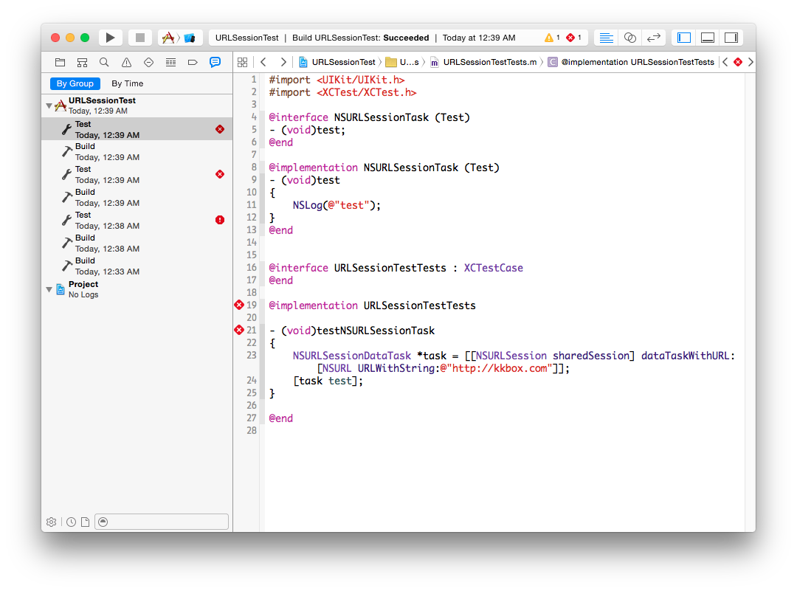

對 NSURLSessionTask 撰寫 Category
---------------------------------

在寫 category 的時候，有時候你也會遇到像 NSURLSessionTask 這種地雷。

假如我們在 iOS 7 上，對 NSURLSessionTask 寫了一個 category 之後，你會
發現，如果我們從 [NSURLSession sharedSession] 產生了 data task 物件，
之後，對這個物件呼叫 category 裡頭的 method，很奇怪，會收到找不到
selector 的錯誤。照理說一個 data task 是 NSURLSessionDataTask，繼承自
NSURLSessionTask，為什麼我們寫的 NSURLSessionTask category 沒用？

到了 iOS 8 的環境下又正常，可以對這個物件呼叫 NSURLSessionTask
category 裡頭的 method，但如果是寫成 NSURLSessionDataTask 的 category，
結果又遇到找不到 selector 的錯誤。

我們來寫一個簡單的 category：

``` objc
@interface NSURLSessionTask (Test)
- (void)test;
@end

@implementation NSURLSessionTask (Test)
- (void)test
{
	NSLog(@"test");
}
@end
```

然後執行看看

```
NSURLSessionDataTask *task = [[NSURLSession sharedSession]
	dataTaskWithURL:[NSURL URLWithString:@"http://kkbox.com"]];
[task test];
```

結果就發生錯誤了：



這件事情很奇怪，你於是會開始想各種可能的方向。—對了，如果有一個
category 不是直接寫在你的 app 裡頭，而是寫在某個 static library，你要
在編譯 app 的最後才把這個 library link 進來，預設 category 並不會
linker 給 link進來，你必須要另外在 Xcode 專案設定的 other linker flag，
加上 -ObjC 或是 -all_load。會是這個問題嗎？你試了一下，發現沒用，還是
一樣收到 unsupported selector 錯誤。

然後你想到，NSURLSessionTask 是個 Foundation 物件，而 Foundation 物件
往往真正的實作與最上層的介面並不是同一個。所以，我們來看看
NSURLSessionTask 的繼承樹到底長成什麼樣子。

程式如下：

``` objc
NSURLSessionDataTask *task = [[NSURLSession sharedSession] dataTaskWithURL:[NSURL URLWithString:@"http://kkbox.com"]];
NSLog(@"%@", [task class]);
NSLog(@"%@", [task superclass]);
NSLog(@"%@", [[task superclass] superclass]);
NSLog(@"%@", [[[task superclass] superclass] superclass]);
```

在 iOS 8 上的結果是：

```
__NSCFLocalDataTask
__NSCFLocalSessionTask
NSURLSessionTask
NSObject
```

在 iOS 7 上的結果是：

```
__NSCFLocalDataTask
__NSCFLocalSessionTask
__NSCFURLSessionTask
NSObject
```

結論，無論是 iOS 8 或 iOS 7，我們建立的 data task，都不是直接產生
NSURLSessionDataTask 物件，而是產生 \_\_NSCFLocalDataTask 這樣的 private
class 的物件。iOS 8 上，\_\_NSCFLocalDataTask 並不繼承
NSURLSessionDataTask，而 iOS 7 上 __NSCFLocalDataTask 甚至連
NSURLSessionTask 都不是。

但如果我們去問，我們建立的這些 data task 到底是不是
NSURLSessionDataTask，像呼叫
`[task isKindOfClass:[NSURLSessionDataTask class]]`，還是會回傳 YES。
其實 `-isKindOfClass:` 是可以 override 掉的，所以，即使
\_\_NSCFLocalDataTask 根本就不是 NSURLSessionDataTask，但我們可以把
\_\_NSCFLocalDataTask 的 `-isKindOfClass` 寫成這樣：

``` objc
- (BOOL)isKindOfClass:(Class)aClass
{
	if (aClass == NSClassFromString(@"NSURLSessionDataTask")) {
		return YES;
	}
	if (aClass == NSClassFromString(@"NSURLSessionTask")) {
		return YES;
	}
	return [super isKindOfClass:aClass];
}
```

也就是說，`-isKindOfClass` 其實並不像你所想像的那麼值得信任。這也就是
寫 Objective-C 這門語言的迷人之處：寫 Objective-C 就像真實的人生一樣，
一個物件就像人一般，一個人能做什麼絕對不是在出生的時候就決定的，而是在
他的一生當中可以隨時改變，而當你用 `-isKindOfClass` 去問一個物件到底是
什麼物件的時候，大概就跟你去問一個 PM 到底會不會規劃產品，或是一個號稱
是 iOS 工程師的人到底會不會寫程式一樣。
