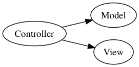
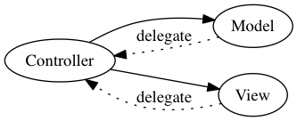
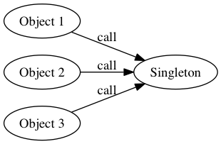

圖解設計模式
------------

我們來把一些常用設計模式中的物件關係畫成圖：

## MVC

MVC 便是將物件分成 Model、View、Controller 三類，幾乎現在主要平台上都
採用這種設計，不過就像前面也提到的，不是每個平台都一致。像 Windows 上
往往把 window 物件當成 controller，但是在 Mac 上 window 被劃入到 view
這一塊。

一般來說會由 Controller 擁有 Model 與 View 物件。

## Delegate

MVC 中，Controller 擁有 View 與 Model，所以 Controller 可以直接呼叫
View 與 Model 上的各種 method，但是當 View 與 Model 需要呼叫
Controller 的時候，會把 Controller 設定成 delegate，而 delegate 只需要
符合 protocol 的定義，不需要是特定 Class，避免 View 與 Model 綁死在某
個 Controller 上。

## Singleton

某個 class 只有一個 instance，這樣在其他地方，都可以集中找到同一個
instance。像 UIApplication 等物件就是 Singleton 物件。

## Notification Center

一個物件改變狀態的時候，其他物件不需要知道這個物件存在，也跟著一起改變
狀態。每個物件之間透過 Notification Center 互相通知、又互相隔絕。

## Factory Method

把 Factory 變成建立物件的唯一入口，其他地方不需要知道某個 class 確實來
說是怎麼做的，就可以建立需要的物件。Factory 於是可以把外部與內部實作隔
絕開來。
