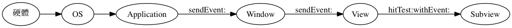

Responder
=========

當我們在 iPhone、iPad 等 iOS 裝置上，用手指按到一個按鈕上的時候，事實
上，我們並不是真的按在一個按鈕上，而是按在螢幕上。是觸控螢幕的硬體接收
了我們的輸入之後，再將我們的觸控輸入送到軟體中，最後營造了「我們的手指
按到了按鈕上」的錯覺。

不同於其他的開發平台，在 iOS 與 Mac OS X 上，事件（Event）只用來表達來
自硬體的各種輸入行為。在 iOS 上的 UIEvent 包含了觸控輸入、藍芽耳機遙控
換歌等，Mac OS X 上的 NSEvent 則包括了鍵盤、滑鼠事件。

事件的傳遞
----------

在 iOS 裝置上，當硬體發生觸控事件，到我們的按鈕發生反應之間，事實上經
歷了：

- 硬體把事件傳到我們的 App 中，交由 UIApplication 物件分派事件
- UIApplication 把事件傳送到 Key Window 中，接著由 Key Window 負責分派
  事件
- Key Window 開始尋找在 View Heirarchy 中最上層的 view controller 與
  view，然後，發現最上層的 view 是我們的按鈕
- 觸發按鈕的 target/action

事件從 application 傳遞到 window，從 window 傳遞到對應的 view 之上的流
程，如果我們反過來看，就會變成「誰最後應該負責處理事件」—如果有個 view
該處理，就會是 view 處理，不然就會 fallback 到 window，window 不處理又
會 fallback 到 application 上。

從 application 到 window 到 view，每一層中可以處理事件的物件，都叫做
responder，要實作NSResponder 或 UIResponder protocol。回到我們會給一個
專有名詞的習慣，所謂 responder，就是「可以處理事件的物件」。

在一堆可以處理事件的物件中，最後被分派到、把事件處理掉的物件，叫做
first responder，而這種一環又一環尋找誰該處理事件的鎖鏈，叫做
Responder Chain。

而這個流程，會在 runloop 當中不斷循環。
