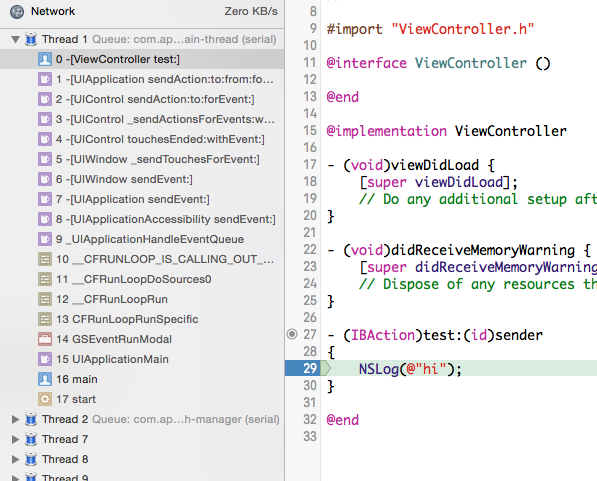

View
----

Application 透過 `sendEvent:` 將事件送到 window，window 也一樣透過
`sendEvent:` 把事件送到 view 上，而在 view 裡頭，則是透過
`hitTest:withEvent:`，在一層又一層的 view heirarchy 裡頭尋找應該處理事
件的 sub view。

比方說，我們現在有個 view，裡頭有兩個 subview：button A 與 button B，在
`hitTest:withEvent:` 這個 method 裡頭，就會先去判斷觸控事件的座標是否
在這兩個 subview 裡頭，如果觸控座標在 button A 的 frame 裡頭，那就該由
button A 來處理事件，`hitTest:withEvent:` 就會回傳 button A。

但 `hitTest:withEvent:` 不但會問觸控事件的座標是否在某個 subview 裡，
也會問這個 subview 是否打算處理事件。假如反過來，我們現在有個 button，
而裡頭有兩個 subview，一個是文字 label、一個是個 image view，這兩個
view 都只負責處理顯示內容，而不處理事件，那麼，這個 button 裡頭的
`hitTest:withEvent:` 最後就會把自己回傳回去，表示是由這個 button 自己
處理事件，而不交由任何的 subview 處理。

有時候我們會藉由修改 `hitTest:withEvent:` 達成一些稀奇古怪的效果，例如，
我們現在有一個 view，裡頭有一個 scroll view，scroll view 只佔他的super
view 的一部分而已，但是我們希望在這個 view 裡頭的任何地方點選，都可以
捲動裡頭的 scroll view。我們這個時候就可以考慮改寫
`hitTest:withEvent:`，不管觸控的位置是否真的在 scroll view 裡頭，
`hitTest:withEvent:` 都回傳這個 scroll view。

當事件從 application、window 傳遞到 view 之後，就會成為一些我們之前就
已經熟悉的 API，在 Mac 上會觸發 `keyDown:`、`mouseDown:` 這些在 NSView
裡頭的 method，至於在 iOS 上，觸控事件傳遞到 view 之後就會觸發一系列跟
觸控事件有關的 method：

- `(void)touchesBegan:(NSSet *)touches withEvent:(UIEvent *)event`
- `(void)touchesMoved:(NSSet *)touches withEvent:(UIEvent *)event`
- `(void)touchesEnded:(NSSet *)touches withEvent:(UIEvent *)event`
- `(void)touchesCancelled:(NSSet *)touches withEvent:(UIEvent *)event`

從這些 method 中，我們會知道觸控事件是否開始、結束、中間手指是否移動，
用戶在螢幕硬體上到底用了幾支手指，每根手指的位置又如何變化，進而知道用
戶到底做了怎樣的手勢：是指用一根手指做了點選（tap）還是橫劃（swipe）、
還是用了兩根以上的手製作了縮放（pinch），甚至是更複雜的手勢。在蘋果官
方文件
*[Multitouch Events](https://developer.apple.com/library/ios/documentation/EventHandling/Conceptual/EventHandlingiPhoneOS/multitouch_background/multitouch_background.html#//apple_ref/doc/uid/TP40009541-CH5-SW9)*
當中，就說明了怎樣用上面這些 UIResponder method，處理各些複雜手勢。

要了解事件是怎樣從 Application 一路送到 View，最簡單的方法，就是寫一個
簡單的 App：這個 App 只有一個按鈕，然後我們在這個按鈕的 action 打上一
個 break point，然後來看一下這個時候的 back trace：

- frame 16 是 `main()`，裡頭執行 UIApplicationMain
- frame 10-14 便是在執行 Runloop
- 在 frame 7-9，可以看到 Runloop 把事件送給 UIApplication
- 在 frame 5-6，可以看到 UIWindow 在處理來自 UIApplication 的事件
- frame 4 在處理我們剛剛講到的 `touchesEnded:withEvent:`
- 最後在 frame 0-3，便是在處理這個按鈕上的 target/action
