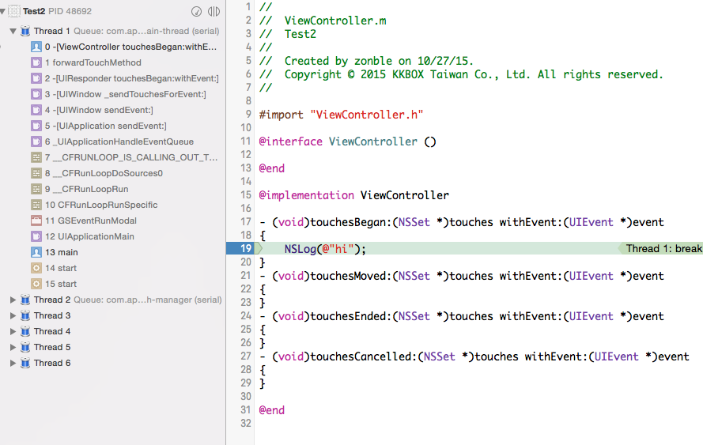

View Controller
---------------

View Controller 本身也是個 responder，因此也實作了 UIResponder
protocol。當觸控事件發生的時候，如果某個 view controller 的 view 都不
處理傳來的 UIEvent，那麼就會轉向詢問這個 view 的 view controller 本身
是否處理這個事件。

在下面的例子裡，我們寫了一個 view controller，但是 view 裡頭沒有任何可
以點按的物件，而 view controller 本身實作了 `-touchesBegan:withEvent:`
等 method。

可以從這邊的 back trace 看到，來自 UIWindow 的觸控事件，被
`forwardTouchMethod` 這個 function，轉發到 view controller 上了。
