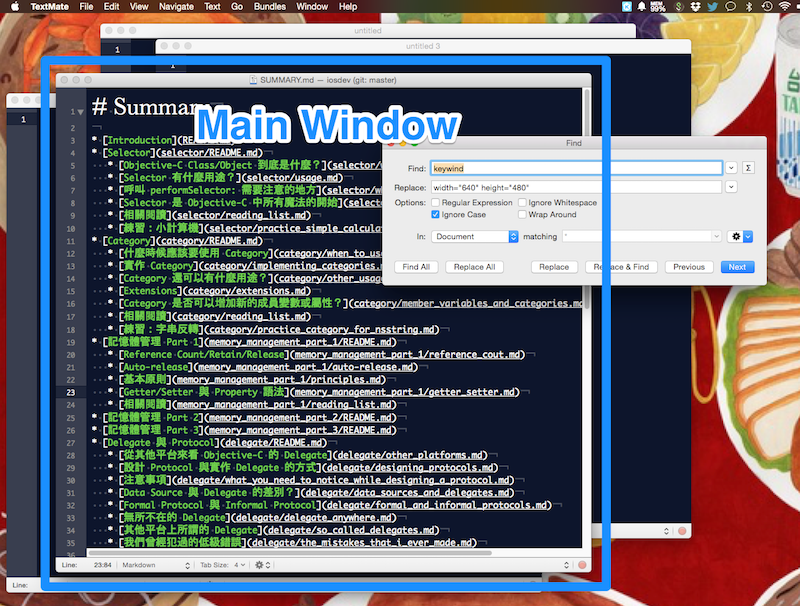
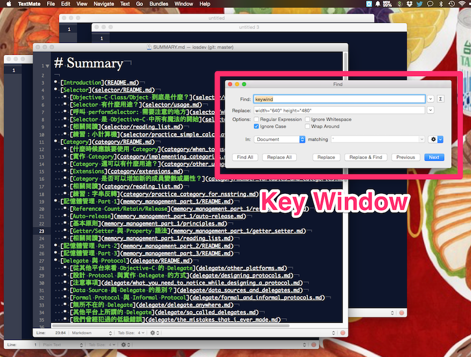

Window
------

Application 在收到觸控等硬體事件之後，會把事件轉發給 key window。如果
你 iOS SDK 問世的前幾年就在寫 iOS App，應該會注意到，Xcode 幫你建立專
案時使用的 template 中，可能就有一段像下面這樣的
`-application:didFinishLaunchingWithOptions` 的實作：

``` objc
- (BOOL)application:(UIApplication *)application
  didFinishLaunchingWithOptions:(NSDictionary *)launchOptions
{
	self.window = [[UIWindow alloc] initWithFrame:[UIScreen mainScreen].bounds];
	ViewController *controller = [[ViewController alloc] init];
	self.navigationController = [[UINavigationController alloc] initWithRootViewController:tabBarController];
	window.rootViewController = self.navigationController;
	[window makeKeyAndVisible];
	return YES;
}
```

當一個 window 被呼叫了 `-makeKeyAndVisible` 之後，就會變成 key window。
但這樣的解釋還是很模糊—到底什麼是 key window？要回答這個問題，我們要先
離開一下 iOS SDK，來看看 Mac。

在 Mac 上，一個 window 除了可以是 key window 之外，還可以成為 main
window。比方說，TextMate 這套文字編輯器是一套 Document-based App，我們
可以同時開很多 window，每個 window 裡頭都代表一份文字檔案，但是，我們
一次也只能在一個 window 當中打字，所以，只有一個 window 的邊框會是比較
深的顏色，其他 window 的邊框則是淺色，代表這些 window 沒有作用。唯一作
用中的 window 就是 main window。



但假如我們現在叫出了 TextMate 的尋找功能，想要在目前正在編輯的文字檔當
中，尋找指定的文字，這時候鍵盤焦點會放在搜尋 window 的關鍵字欄位上。現
在搜尋功能 window 就是 key window。Key window 所謂的 key，其實就是鍵盤
keyboard 的 key，你在哪個 window 打字，那個 window 就是 key window。而
由於我們是對現在正在編輯的文件做搜尋，所以我們在搜尋 window 這個 key
window 打字之後，會再去尋找 main window，把進行搜尋這件工作送往 main
window。



很多時候 main window 與 key window 會是同一個。比方說，我們找到了關鍵
字，離開了搜尋 window，回到主要文件 window 打字，那麼，這份文字檔的
window 就同時是 main window 與 key window。

在 iOS 上，由於每個 App 主要只有一個處理事件的 window，因此沒有需要區
分 main window 與 key window，因此 SDK 的設計上就只有 key window，而沒
有 main window。

其實 iOS App 可以擁有多個 window。在蘋果推出 AirPlay 功能，讓 iOS App
的畫面可以投射到 AppleTV 之後，除了兩邊完全鏡像之外，我們也可以選擇在
AppleTV 的畫面上顯示不一樣的內容，像 Keynote 這套 App 在連接到 AppleTV
之後，可以選擇 AppleTV 上是目前所在的簡報頁面，iOS 裝置上則顯示下一頁
投影片方便提詞，實作方式就是建立第二個 Window，然後選擇把第二個 window
放在 AppleTV 上。但是在 AirPlay 的狀況下，AppleTV 的畫面只有顯示的功能
而已，我們並不會在這個 window 中打字。

在另外一個情境下，我們也可能會想要建立自己的 window。在不少 App 中，其
實有使用一項 UI 設計：在畫面上方的 status bar 部分，額外顯示提示訊息，
使用 status bar message 當關鍵字在 github 上搜尋，就可以看到至少有
[MTStatusBarOverlay](https://github.com/myell0w/MTStatusBarOverlay)、
[FDStatusBarNotifierView](https://github.com/frankdilo/FDStatusBarNotifierView)、
[JDStatusBarNotification](https://github.com/jaydee3/JDStatusBarNotification)
這麼多個專案。

其實 iOS 的 status bar 本身就是一個 window，而這個window 的 level 會比
我們 App 的 window 高，於是 status bar 會一直疊在我們的 App 畫面上方，
不論我們對原本的 window 怎麼增加 subview，都不會影響 status bar。如果
我們想要蓋過 status bar，方法就只有建立新的 window，level 設得比
status bar window 更高，然後呼叫 `makeKeyAndOrderFront`。
