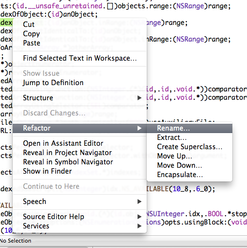

Selector
========

基本定義
--------

我個人在學習新事物的時候，通常會這麼挑戰自己：我有沒有辦法用一句話描述
這件事物是什麼？還有，這件事物可以用在哪裡？我在接下來的章節中，也會以
這樣的方式展開。以Selector 來說，我個人就會做一個簡短的定義：

> *Selector 就是用字串表示某個物件的某個 method*

那，Selector 有什麼用途呢？

> *因為 method 可以用字串表示，因此，某個 method
> 就可以變成可以用來傳遞的參數。*

至於要更進一步了解
Selector，我們就要從一些更基本的事情開始講起：Objective-C 裡頭的物件以及
Class，到底是什麼？

Objective-C Class/Object 到底是什麼？
-------------------------------------

你應該在其他的文件裡頭聽說過，Objective-C 是 C 語言的 Superset，在 C語
言的基礎上，加上了一層稀薄的物件導向，而 Cocoa Framework 的 Cocoa這個
名字就是這麼來的—Cocoa 就是 C 加上 OO。也因此，在 Objective-C程式中，
可以直接呼叫 C 的 API，而如果你將 .m 改名叫做.mm，程式裡頭還可以混和
C++ 語法，變成 Objective-C++。

Objective-C 的程式在 compile time 時，Compiler 其實會編譯成 C然後繼續
編譯。所有的Objective-C Class 會變成 C 的 Structure，所有的method （以
及 block）會被編譯成 C function，接下來，在執行的時候，Objective-C
runtime 才會建立某個 C Structure 與 C function 的關聯，也就是說，一個
物件到底有哪些 method可以呼叫，是在 runtime 才決定的。

### Objective-C 物件會被編譯成 Structure

比方說，我們現在寫了一個簡單的 Class，裡頭只有 int a 這個成員變數：

``` objc
@interface MyClass : NSObject {
    int a;
}
@end
```

會被編譯成

``` c
typedef struct {
    int a;
} MyClass;
```

因為 Objective-C 的物件其實就是 C 的 structure，所以當我們建立了一個
Objective-C 物件之後，我們也可以把這個物件當做呼叫 C structure 呼叫
[^1]：

``` objc
MyClass *obj = [[MyClass alloc] init];
obj->a = 10;
```

### 對 Class 加入 method

在執行的時候，runtime 會為每個 Class準備好一張表格，表格裡頭會以一個字
串當 key，每個 key 會對應到 C function的指標位置。Runtime 裡頭，把實作
的 C function 定義成 `IMP` 這個type；至於拿來當作 key 的字串，就叫做
selector，type 定義成 `SEL`，然後我們可以使用 @selector 關鍵字建立
selector。而其實 `SEL` 就是 C字串，我們可以來寫點程式檢查一下：

``` objc
NSLog(@"%s", (char *)(@selector(doSomething)));
```

我們會順利印出「doSomething」這個 C 字串。

每次我們對一個物件呼叫某個 method，runtime 在做的事情，就是把 method的
名稱當做字串，尋找與字串符合的 C function實作，然後執行。也就是說，下
面這三件事情是一樣的：

我們可以直接要求某個物件執行某個 method：

``` objc
[myObject doSomthing];
```

或是透過 `performSelector:` 呼叫。 `performSelector:` 是 `NSObject` 的
method，而在 Cocoa Framework 中所有的物件都繼承自 `NSObject`，所以每個
勿建都可以呼叫這個 method。

``` objc
[myObject performSelector:@selector(doSomething)];
```

我們可以把 `performSelector:`想成台灣的電視新聞用語：如果原本的句子是
「我正在吃飯」，使用`performSelector:`就很像是「我正在進行一個吃飯的動
作」。而其實，最後底層執行的是`objc_msgSend` 。

``` objc
objc_msgSend(myObject, @selector(doSomething), NULL};
```

我們常常會說「要求某個 object 執行某個 methood」、「要求某個 object執
行某個 selector」，其實是一樣的事情，我們另外也常聽到一種說法，叫做
「對 receiver 傳遞message」，這則是沿用來自 Small Talk 的術
語—Objective-C 受到了 Small Talk 語言的深刻影響—但其實也是同一件事。

因為一個 Class 有哪些 method，是在 runtime一個一個加入的；所以我們就有
機會在程式已經在執行的時候，繼續對某個 Class加入新 method，一個 Class
已經存在了某個 method，也可以在 runtime用別的實作換掉，一般來說，我們
會用 Category 做這件事情，不過 Category會是下一章的主題，會在下一章繼
續討論。

我們在這裡首先要記住一件非常重要的事：在 Objective-C 中，一個 Class會
有哪些method，並不是固定的，如果我們在程式中對某個物件呼叫了目前還不存
在的method，編譯的時候，compiler並不會當做編譯錯誤，只會發出警告而已，
而跳出警告的條件，也就只有是否有引入的header 中到底有沒有這個 method而
已，所以我們一不小心，就很有可能呼叫到了沒有實作的method（或這麼說，我
們要求執行的 selector並沒有對應的實作）。如果我們是使用
`performSelector:`呼叫，更是完全不會有警告。直到實際執行的時候，才發生
unrecognized selector sent to instance 錯誤而導致應用程式 crash。

之所以只有警告，而不當做編譯錯誤，就是因為某些 method有可能之後才會被
加入。蘋果認為你會寫出呼叫到沒有實作的selector，必定是因為你接下來在某
個時候、某個地方，就會加入這個 method的實作。

由於 Objective-C 語言中，物件有哪些 method 可以在 runtime改變，所以我
們也會將 Objective-C 列入像是 Perl、Python、Ruby等所謂的動態語言
（Dynamic Language）之林。而在寫這樣的動態物件導向語言時，一個物件到底
有哪些method 可以呼叫，往往會比這個物件到底是屬於哪個 Class 更為重要。
[^2]

如果我們不想要用 Category，而想要自己動手寫點程式，手動將某些 method加
入到某個 Class 中，我們可以這麼寫。首先宣告一個 C function，只少要有兩
個參數，第一個參數是執行 method 的物件，第二個參數是seelctor，這這樣：

``` objc
void myMethodIMP(id self, SEL _cmd) {
    doSomething();
}
```

接下來可以呼叫 `class_addMethod` 加入 selector 與實作的對應。

``` objc
#import <objc/runtime.h>
// 中間省略
class_addMethod([MyClass class], @selector(myMethod), (IMP)myMethodIMP, "v@:");
```

接下來就可以這麼呼叫了：

``` objc
MyClass *myObject = [[MyClass alloc] init];
[myObject myMethod];
```

Selector 有什麼用途？
---------------------

我們會在幾個地方應用 selector：

### Target/Action pattern

Selector 的主要用途，就是實作 target/action。相信你應該試過在 Xcode中
建立一個新專案之後，可能在 Interface Builder 中建立了一個 UIButton或是
NSButton 物件，然後將按鈕連接到 controller 中宣告成 IBAction 的method
上，這時候，我們的 Controller 就是 Button 的 target，而要求controller
執行的 method，就叫做 action。

我們在 Interface Builder裡頭做的事情，也可以透過程式碼做到。而如果我們
想要設計一套系統 Framework裡頭所沒有的客製 UI 元件，第一步就是要了解怎
麼實作 target/action。

在 UIKit 中的 Target/Action 稍微複雜一些，因為同一個按鈕可以一次連接好
幾個 target 與 action，我們在這邊使用 AppKit 示範—在 Mac 上，一次只會指
定單一的 target 與 action。如果想要產生一個按鈕或是其他的 custom
control，我們會繼承自 NSView，然後建立兩個成員變數：target 與 action，
action 是一個 selector。

``` objc
@interface MyButton : NSView
{
    id target;
    SEL action;
}
@property (assign) IBOutlet id target;
@property (assign) SEL action;
@end

@implementation MyButton
- (void)mouseDown:(NSEvent *)e
{
    [super mouseDown:e];
    [target performSelector:action withObject:self];
}
@synthesize target, action;
@end
```

我們在這邊將 target 的型別設定為 id，代表的是任意 Objective-C物件的指
標，如同前面提到，Controller 到底是什麼class，在這邊並不重要，而且我們
也不該將 target 的 class寫死，因為如此一來，就變成只有某些 Controller
才能使用這個按鈕。

我們接著在 `mouseDown:` 中，要求 target 執行之前傳入的 action，由於
selector 是字串，是可以傳遞的參數，所以也就可以成為按鈕的成員變數。

我們接下來也可以使用程式碼連結 target 與 action，在 Controller
的程式中，只要這麼寫即可：

``` objc
[(MyButton *)button setTarget:self];
[(MyButton *)button setAction:@selector(clickAction:)];
```

把要做什麼事情當做參數傳遞，每個語言都有不同的作法。 Objective-C用的是
拿字串來尋找對應的實作 function 指標，在 C語言裡頭就會直接傳遞指標，一
些更高階的語言或著是把一段程式碼當做是字串傳遞，要使用的時候再去
evaluate這段程式碼字串，或是一段程式碼本身就是一個物件，所以可以把程式
碼當做物件傳遞，我們稱之為「匿名函式」（Anonymous Function ），現在
Objective-C 也有匿名函式，叫做block，不過，對這個 1983年誕生的語言來說，
這是很晚近才有的功能，我們會稍晚討論。

### 檢查 method 是否存在

前面提到，我們有可能會呼叫到並不存在的method，如果這麼做就會產生錯誤。
但我們有時候會遇到的狀況是：我們並不確定某些method 到底有沒有實作，如
果有，就呼叫，如果沒有，就略過或是使用其他的method。

這種狀況最常遇到的就是顧及向下相容。比方說，在 iOS 4 之後，才開始支援
Retina Display，我們在繪圖的 code中要決定現在應該繪製怎樣精細程度的圖
片，需要知道目前用的是傳統的一倍品質，還是Retina Display 的兩倍品質，
就要去問 `UIScreen` 的 `scale`屬性。但是，當我們開始支援 iOS 4 的時候，
可能還要顧及 iOS 3的使用者，導致我們不能夠貿然直接呼叫 `scale`（當然，
如果你的應用程式都只支援最新版本的作業系統，那是再幸福不過的事），而是
要去檢查這個屬性是否存在，如果沒有，就代表使用者的作業系統是iOS 4之前
的版本，我們只需要提供一倍品質的圖片就可以了。在未來，只要遇到向下相容，
我們就還是得處理這樣的狀況。

另外，雖然蘋果只允許 iOS上面的應用程式只能夠是單一的執行檔，不能夠在執
行時載入其他的binary，但是在 Mac OS X 上面卻可以載入 loadable bundle，
或是在應用程式中放置 private framework，一個物件的某些 method可以不在
主程式中，而是在 plug-in 中實作。我們也要做這樣的檢查。

檢查某個物件是否實作了某個 method，只要呼叫 `respondsToSelector:`
就可以了：

``` objc
BOOL scale = 1.0;
if ([[UIScreen mainScreen] respondsToSelector:@selector(scale)]) {
    scale = [UIScreen mainScreen].scale;
}
```

在其他程式語言中，也需要這樣檢查 method 是否存在嗎？在 Ruby 語言中，有
類似的 `respond_to?` 語法，至於 Python，我們或著可以用 `dir`這個
funciton 檢查某個物件的全部 attribute 中是否存在對應到某個 method的
key，但是更常見的作法就是使用 try…catch 語法，如果遇到某個 method可能
不存在，就包在 try…catch 的 block 中，像是：

``` python
try:
    myObject.doSomething()
except Exception, e:
    print "The method does not exist."
```

在 Objective-C 中，同樣也有 try…catch 語法，在許多語言中，善用
try…catch，也可以將程式寫得清楚有條理，但是我們並不鼓勵在 Objective-C
語言中使用。原因與 Objective-C 的記憶體管理機制有關，如果大量使用
try…catch，會導致記憶體漏水（Memory Leak）。

Objective-C 本身並不算有記憶體回收機制（Garbage Collection，以下簡稱GC）
的語言，雖然在 Mac OS X 10.5 的時代，蘋果嘗試在 Objective-C 上實作GC，
但是成果實在不甚理想，如果貿然在 Mac OS X 上大量使用GC，實際運作會有嚴
重的記憶體漏水問題；蘋果在推出 iOS之後，也不敢將這套機制用在行動裝置上，
而是在 iOS 5 時放棄在 runtime管理記憶體，而是推出 ARC（Automatic
Reference Counter），在 compile time時決定什麼時候應該釋放記憶體。

由於傳統的 Objective-C 記憶體管理大量使用一套叫做 auto-release的機制—
雖然說是auto，其實也沒多自動，頂多算是半自動—將一些應該要釋放的物件延
遲釋放，在這一輪runloop 中先不釋放，而是到了下一輪 runloop開始時才釋放
這些記憶體。如果使用 try…catch 捕捉例外錯誤，就會跳出原本的runloop，而
導致應該釋放的記憶體沒被釋放。

### Timer

`NSObject` 除了 `performSelector:` 這個 method 之外，同樣以
performSelector 開頭的，還有好幾組 API 可以呼叫，例如
`-performSelector:withObject:afterDelay:`
，就可以讓我們在一定的秒數之後，才要求某個 method 執行。

``` objc
[self performSelector:@selector(doSomething) withObject:nil afterDelay:1.0];
```

如果時間還不到已經預定要執行的時間，method還沒有執行，我們也可以反悔，
取消剛才預定要執行的 method，只要呼叫
`cancelPreviousPerformRequestsWithTarget:` 即可。如以下範例：

``` objc
[NSObject cancelPreviousPerformRequestsWithTarget:self];
```

`performSelector:withObject:afterDelay:` 的效果相當於產生 `NSTimer`物
件，當我們想要延遲呼叫某個method，或是要某件事情重複執行，都可以透過建
立 `NSTimer`物件達成，要使用 timer，我們也必須使用 selector 語法。

我們先定義一個 timer 要做的事情：

``` objc
- (void)doSomething:(NSTimer *)timer
{
    // Do something
}
```

然後透過 `doSomething:` 的 selector 建立 timer

``` objc
NSTimer *timer = [NSTimer scheduledTimerWithTimeInterval:1.0
                          target:someObject
                          selector:@selector(doSomething:)
                          userInfo:nil
                          repeats:YES];
```

除了透過指定 target 與 selector 之外，還可以透過指定 `NSInvocation`呼
叫建立 `NSTimer` 物件；`NSInvocation` 其實就是將 target/action以及這個
action 中要傳遞給 target 的參數這三者，再包裝成一個物件。呼叫的method
是 `scheduledTimerWithTimeInterval:invocation:repeats:`。

透過建立 `NSInvocation` 物件建立 timer 的方式如下。

``` objc
NSMethodSignature *sig = [MyClass instanceMethodSignatureForSelector:
                                  @selector(doSomething:)];
NSInvocation *invocation = [NSInvocation invocationWithMethodSignature:sig];
[invocation setTarget:someObject];
[invocation setSelector:@selector(doSomething:)];
[invocation setArgument:&anArgument atIndex:2];
NSTimer *timer = [NSTimer scheduledTimerWithTimeInterval:1.0
                          invocation:invocation
                          repeats:YES];
```

請注意，在呼叫 `NSInvocation` 的 `setArgument:atIndex`的時候，我們要傳
遞的參數，要從 2 開始，因為在這邊我們要想成，這是給`objc_msgSend` 呼叫
用的參數，在 0 的參數是物件的 self，位在 1 的則是selector。

### 接收 `NSNotification`

我們稍晚才會討論 `NSNotification` 以及 `NSNotificationCenter`，不過在
這邊先簡單提到：如果我們要接收 `NSNotification`，我們也要在開始訂閱通
知的時候，指定要由哪個 selector 處理這個通知。

### 在某個 Thread 執行 method

除了已經提到的 `-performSelector:withObject:afterDelay:` 之外，
`NSObject` 還有好幾個 method，是讓指定的 selector 丟到某個 Thread執行，
包括：

-   `-performSelectorOnMainThread:withObject:waitUntilDone:modes:`
-   `-performSelectorOnMainThread:withObject:waitUntilDone:`
-   `-performSelector:onThread:withObject:waitUntilDone:modes:`
-   `-performSelector:onThread:withObject:waitUntilDone:`
-   `-performSelectorInBackground:withObject:`

假如有一件事情—在這邊叫做doSomething—會執行太久，我們可以將這件事情丟
到背景，也就是另外建立一條Thread 執行：

``` objc
[self performSelectorInBackground:@selector(doSomething) withObject:nil];
```

注意，在背景執行時，這個 method 的內部需要建立自己的 Auto-Release Pool。

執行完畢後，我們可以透過
`-performSelectorOnMainThread:withObjectwaitUntilDone:` ，通知主
Thread我們已經把事情做完了。像是，如果我們要轉換一個比較大的檔案，就可
以在背景實際轉檔，轉完之後，再告訴主Thread，在 UI 上跳出提示視窗，提示
使用者已經轉檔完畢。

``` objc
- (void)doSomthing
{
    @autoreleasepool {
        // Do something here.
        [self performSelectorOnMainThread:@selector(doAnotherThing)
              withObject:nil
              waitUntilDone:NO];
    }
}
```

### Array 排序

我們今天想要對 `NSArray` 做排序，就得要告訴這個 Array怎樣比較裡頭每個
東西的大小，所以我們需要把怎麼比較大小這件事情傳遞到array 上。 Cocoa
Framework 提供三種方式排序Array，我們可以把怎麼比大小寫成 C Function，
然後傳遞 C Function的指標，現在也可以傳遞 Block，而如果 Array 裡頭的物
件有負責比較大小的method 的話，我們也可以透過 selector 指定要用哪個
method 排序。

`NSString`、`NSDate`、`NSNumber` 以及 `NSIndexPath`，都提供
`compare:`這個 method，假如有一個 array 裡頭都是字串的話，我們就可以使
用`compare:` 排序， `NSString` 用來比較大小順序的 method與選項（像是是
否忽略大小寫，字串中如果出現數字，是否要以數字的大小排列而不是只照字元
順序…等等），其中最常用的，該是`localizedCompare:` ，這個 method會參考
目前使用者所在的系統語系決定排序方式，像是簡體中文語系下用拼音排序，繁
體中文語系下用筆劃排序…等等。

我們使用 `sortedArrayUsingSelector:` 產生重新排序的新 Array，如果是
`NSMutableArray`，則可以呼叫 `sortUsingSelector:`

``` objc
NSArray *sortedArray = [anArray sortedArrayUsingSelector:
                                 @selector(localizedCompare:)];
```

我們也可以透過傳遞 selector，要求 Array 裡頭每一個物件都執行一次指定的
method。

``` objc
[anArray makeObjectsPerformSelector:@selector(doSomething)];
```

### 代替 if...else 與 switch…case

因為 selector 其實就是 C 字串，除了可以當做參數傳遞之外，也可以放在
array 或是 dictionary 裡頭。有的時候，如果你覺得寫一堆 if…else 或是
switch…case 太過冗贅，例如，原本我們可能這麼寫：

``` objc
switch(condition) {
    case 0:
        [object doSomething];
        break;
    case 1:
        [object doAnotherThing];
        break;
    default:
        break;
}
```

如果沒有什麼會超過邊界的問題的話，其實可以考慮搭配 Xcode 4.4 之後所提供
的 literal 新寫法 [^3] ，看起來就精簡一些。

``` objc
[object performSelector:NSSelectorFromString(@[@"doSomething",
    @"doAnotherThing"][condition])];
```

我們可以使用 `NSStringFromSelector` ，將 selector 轉換成 `NSString`
，反之，也可以使用 `NSSelectorFromString` 將 `NSString` 轉成 selector。

### …呼叫 Private API

Objective-C 裡頭其實沒有真正所謂的 private method，一個物件實作了那些
method，即使沒有 import 對應的header，我們都呼叫得到。系統裡頭許多原本
就內建的 class，有一些 header並沒有宣告的 method，但是從一些相關網站或
是其他管道，我們就是知道有這些method，先不管究竟是什麼原因，我們有的時
候就是想要呼叫看看，這時候我們往往會用`performSelector:` 呼叫。原因也
很簡單：因為我們沒有 header。

但我們並不建議做這樣的事情：今天一個 method 沒有被放在 header裡頭，就
代表在作業系統改版的時候，系統可能把整個底層的實作換掉，這個method 可
能就此消失，而造成系統升級之後，因為呼叫不存在的 method而造成應用程式
crash。而如果你打算寫一套 iOS 應用程式，在 AppSrtore上架販售，蘋果的審
查過程中就會拒絕使用 private API 的軟體。

呼叫 `performSelector:` 需要注意的地方
--------------------------------------

我們在呼叫 `performSelector:` 的時候要注意幾點：

### 對 super 呼叫 performSelector:

前面雖然提到，對一個物件直接呼叫某個 method，或是透過
`performSelector:`呼叫，意義是一樣的，但如果是對 super 呼叫，卻有不一
樣的結果。如果是：

``` objc
[super doSomthing];
```

代表的是呼叫 super 的 doSomthing 實作。但如果是：

``` objc
[super performSelector:@selector(doSomething)];
```

呼叫的是 super 的 `performSelector:` ，最後結果仍然等同於
`[self doSomething]` 。

### Refactor 工具

隨著專案的發展，我們可能後來覺得當初某個 method的命名並不恰當，所以想
要換個名字，這時候與其使用搜尋/替代功能，不如直接使用Xcode 提供的
Refactoring 工具：在想要改名字的 method上面點選滑鼠右鍵，就會出現選單，
然後從「Refactor」中選擇「Rename」。



執行之後，Xcode 除了把這個 method
的名字換掉，也會同時更新所有專案中呼叫這個 method
的程式，但，如果我們當初是用 `performSelector:` 呼叫要執行的
method，Xcode 並不會把裡頭的 selector
也換掉，只會出現簡短的警告訊息而已，如果我們忽略了這些警告，之後執行的時候，就會出現找不到
selector 的錯誤。我們需要格外小心。

[^1]: 不過，如果你直接在程式裡頭這麼呼叫，Xcode 會在編譯的時候發出警告，告訴你在不久的將來會禁止這樣直接呼叫物件的成員變數，如果想要取用成員變數，必須另外寫 getter/setter。而如果這個成員變數被宣告成是 private 的，Xcode 會直接出現編譯錯誤，禁止你這樣呼叫。

[^2]: 這種強調物件有哪些 method，會比物件繼承自哪個 Class 來得重要的觀念，有一個專有名詞，叫做 Duck Typing，中文翻譯做「鴨子型別」。觀念是：我眼前這個東西到底是不是鴨子？它是不是鳥類或是哪個種類根本就不重要，反正它走路游泳像鴨子，叫起來像鴨子，那我就當它是鴨子。可以參見Wikipedia 上的說明： <http://en.wikipedia.org/wiki/Duck_typing> 。

[^3]: 參見 <http://developer.apple.com/library/mac/#documentation/DeveloperTools/Conceptual/WhatsNewXcode/Articles/xcode_4_4.html>
