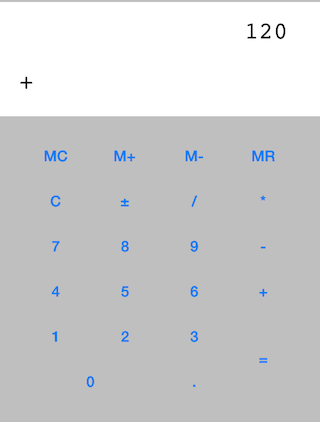

練習：小計算機
--------------

### 練習範圍

- Interface Builder
- Target Action
- Selector

### 練習目標

我們要在 iOS 裝置上寫一個小計算機，這個計算機需要有以下功能：

- 有顯示目前輸入數字與運算結果的 text label
- 有可以輸入數字與小數點的按鈕
- 輸入數字後，按下加減乘除按鈕後，在輸入數字，然後按下等於或其他加減乘
  除按鈕，就會進行對應的四則運算，並輸出運算結果
- 初始數字為 0 時，如果按一次 0，還是 0
- 初始數字為 0 時，如果按一次 1，會變成 1
- 在輸入過程中，小數點只能夠出現一次，之後再按小數點沒作用
- 如果已經按了一個加減乘除按鈕，再按一次另一個加減乘除按鈕，後面輸入的
  運算子會代替原本的，而不會立刻執行運算
- 如果遇到任何數字除 0 的狀況，要跳出 alert

### 練習內容

- 首先使用 Interface Builder 拉出所有需要的 UI 元件
- 建立並連結必要的 IBOutlet 與 IBAction
- 輸入數字完畢後，請使用 NSDecimalNumber 這個 class 儲存數字
- 輸入加減乘除運算子時，請使用 NSDecimalNumber 的運算 method 的
  selector 儲存，包括：
	- decimalNumberByAdding:
	- decimalNumberBySubtracting:
	- decimalNumberByMultiplyingBy:
	- decimalNumberByDividingBy:
- 執行運算時，左右兩邊的數字都應該是 NSDecimalNumber，然後使用之前所儲
  存的 selector，用 `performSelector:withObject:` 執行這個 selector，
  像是 `[leftOperand performSelector:savedSelector withObject:rightOperand]`
