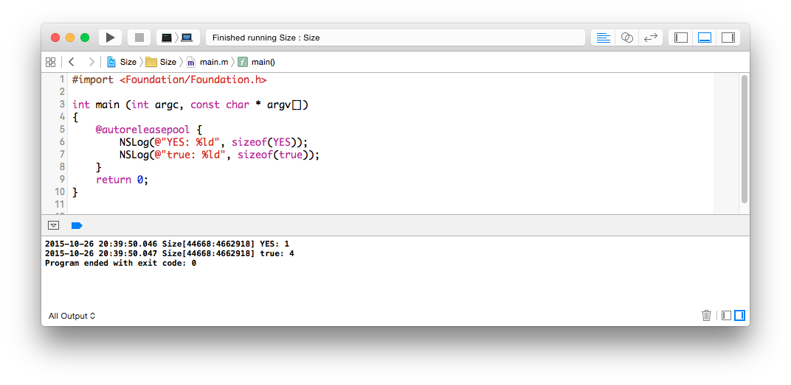

bool 與 BOOL
------------

Objective-C 語言是在 C 語言的基礎上，又加了一層物件導向與動態語言特性
的語言，很多基本型別是直接來自於 C 語言。C 語言在發展之初，並沒有布林
值，於是 Objective-C 語言在發展的過程中，定義了自己的 BOOL，但是在 C99
規格中，C 語言又有了自己的布林型別 bool，而 Objective-C 又可以混和 C++
語法變成 Objective-C++，C++ 裡頭也有 bool。

那麼，Objective-C 的 BOOL，與 C99 以及 C++ 的 bool 有什麼差別呢？我們
來看<objc/objc.h> 裡頭的宣告，這是 iOS 9 SDK 的版本：


``` objc
#include <stdbool.h>

....

/// Type to represent a boolean value.
#if (TARGET_OS_IPHONE && __LP64__)  ||  TARGET_OS_WATCH
#define OBJC_BOOL_IS_BOOL 1
typedef bool BOOL;
#else
#define OBJC_BOOL_IS_CHAR 1
typedef signed char BOOL;
// BOOL is explicitly signed so @encode(BOOL) == "c" rather than "C"
// even if -funsigned-char is used.
#endif

#if __has_feature(objc_bool)
#define YES __objc_yes
#define NO  __objc_no
#else
#define YES ((BOOL)1)
#define NO  ((BOOL)0)
#endif
```

也就是說，在 iOS 的 64 位元或是在 Apple Watch 上，Objective-C 的 BOOL
會直接等於定義在 stdbool.h 裡頭的 bool，其實是 int，而如果使用了 C++，
那麼stdbool.h 裡頭的定義就變成是 C++ 的 bool。但，如果是在 Mac OS X 上，
或是32 位元的 iOS 環境下，BOOL 就會被定義成是一個 char，而 BOOL 與
bool，就分別是一個 byte 或是四個 bytes 的差別。



所以，在 64 位元或 Apple Watch 上，BOOL 與 bool 並沒有差別，但我們通常
不能假設我們寫的 code 只會在這種環境下執行，雖然在其他環境下，使用BOOL
或是 bool 通常也沒什麼影響，但既然某個 API 明確就是要求你傳入BOOL，那
就傳入 YES 或 NO，好像也沒什麼非要傳入 true 或 false 的理由。

另外，當我們想把 BOOL 轉成 NSNumber，最簡單的寫法還是直接使用Xcode 4.4
之後的 literals 的寫法，寫成 `@(YES)` 或 `@(NO)`，另外 Core Foundation
裡頭也定義了 kCFBooleanTrue 與 kCFBooleanFalse，也具有同樣的功能。
