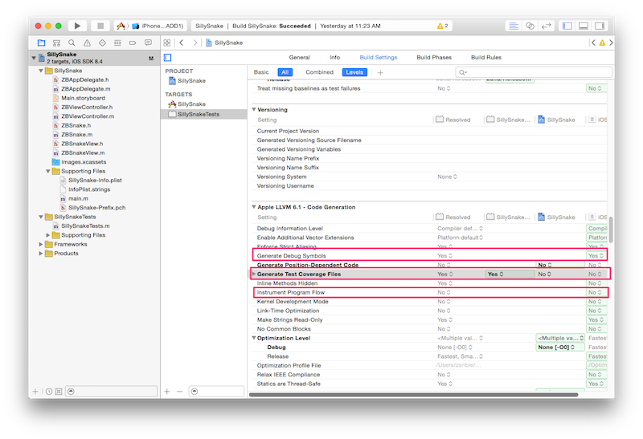
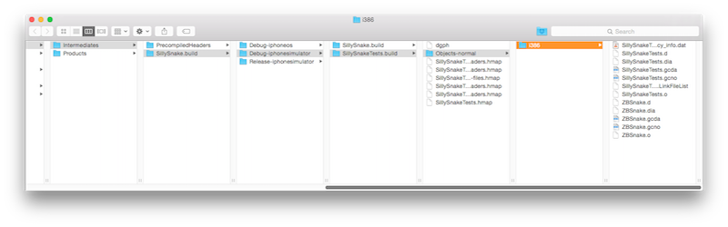
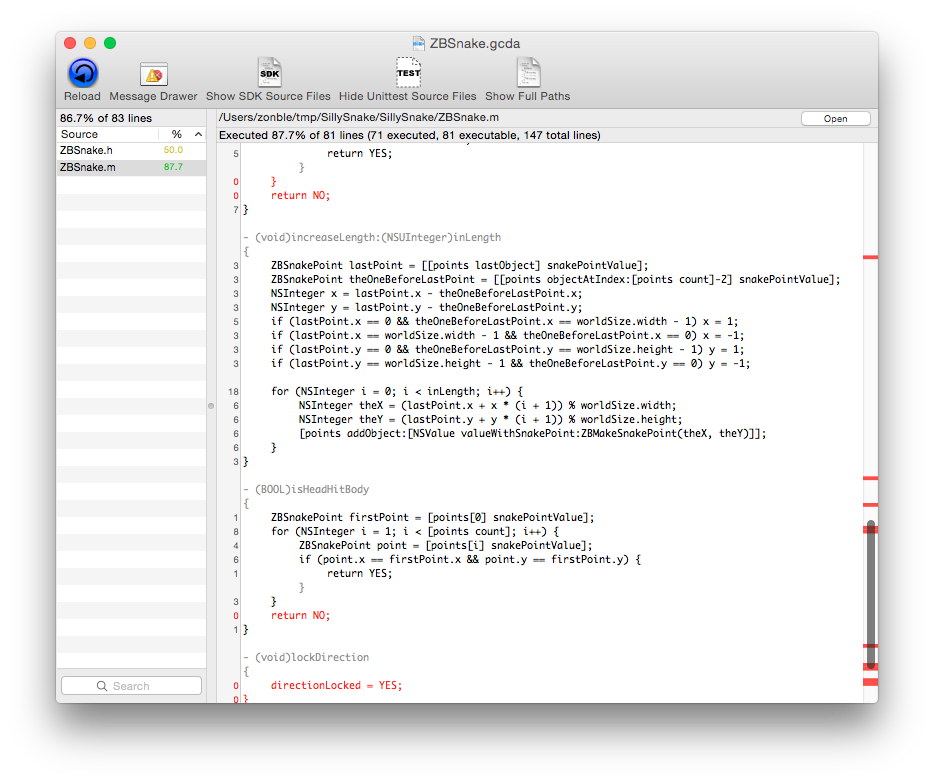

覆蓋率（Coverage）
-----------------

寫了單元測試之後，我們下一步就會想要計算覆蓋率。所謂覆蓋率就是我們的單
元測試覆蓋了程式的多少比例，也就是，有多少程式被測試到、以及沒有被測試
到。當我們發現有程式沒有被測試到之後，便進一步撰寫更多的 test case，確
保我們的程式經過完整測試。

要讓 Xcode 幫我們產生覆蓋率報告，我們要調整一下 Xcode 裡頭的專案設定，
將 Build Setting 下 Apple LLVM 區段的三項設定設成 YES。分別是：

- Generate Debug Symbol
- Generate Test Coverage File
- Instrument Program Flow

這三項設定的位置如下圖：

Xcode 產生出來的覆蓋率報告格式為 .gcno 檔案，但檔案產生出來的位置預設
會在不是很容易找到的地方。這個檔案會出現在編譯專案時產生的
Intermediates 目錄下，如果你沒有改過 Xcode 偏好設定中 Locations ->
Derived Data 的目錄設定的話，並且使用 iOS 模擬器執行測試的話，要尋找
[.gcno 檔案](https://gcc.gnu.org/onlinedocs/gcc-4.1.0/gcc/Gcov-Data-Files.html)
，位置大概是：

- 首先進入你個人目錄下的 ~/Library/Developer/Xcode/DerivedData 目錄
- 繼續進入 `<專案名稱>-<一串亂碼>/Build/Intermediates/<專案名稱>.build/Debug-iphonesimulator/<專案名稱>Tests.build/Objects-normal/i386` 目錄。比方說，我的專案名稱叫做 SillySnake，我就在 `~/Library/Developer/Xcode/DerivedData/SillySnake-dccqebabizkqeabeylczwkqwwbzj/Build/Intermediates/SillySnake.build/Debug-iphonesimulator/SillySnakeTests.build/Objects-normal/i386` 目錄下，找到了對應的檔案

找到對應的檔案之後，我們可以用
[gcov](https://gcc.gnu.org/onlinedocs/gcc/Gcov.html) 這個 command line
工具開啟、閱讀 .gcno 檔案，不過，如果有 GUI 工具那就更理想了；我們可以
用 [coverstory](https://code.google.com/p/coverstory/) 這套 open
source 的工具瀏覽 .gcno 檔案。

在畫面的左方，會列出這次測試中，測試了哪些檔案，以及每個檔案的測試覆蓋
率。在畫面的右方則是程式碼，有測試到的程式會以黑色顯示，沒有測試到的程
式則會有紅色顯示。
