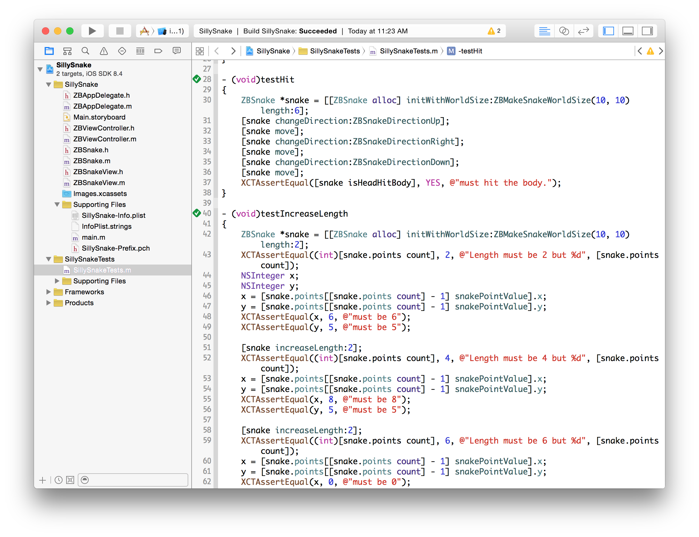
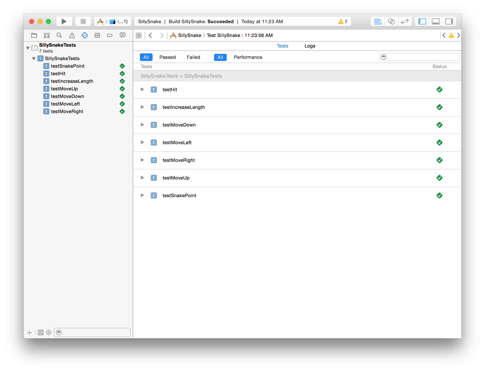

執行測試
--------

寫了測試程式之後，我們可以在 Xcode 裡頭按下 Product->Test 執行單元測試。
如果XCTAssertEqual 這行 assert 出現問題，Xcode 就會立刻出現警告。

我們在 Xcode 裡頭有幾種不同的方式檢視單元測試的結果。在程式碼的編輯畫
面中，每一個 test case 前方會出現一個菱形的圖示，如果這個圖示是空白的，
代表還沒有執行測試，執行完畢之後，如果成功，就會是綠色，反之就會變成紅
色。

